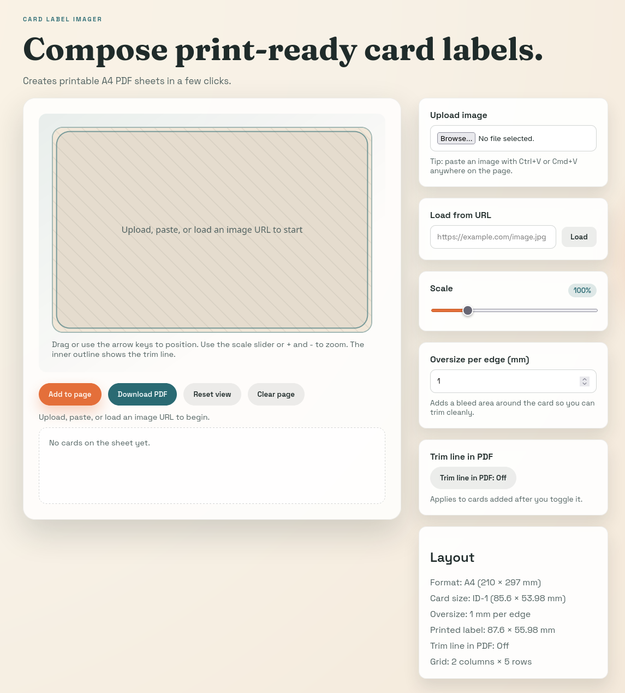

# Card label imager

Generate printable A4 PDFs of ID-1 card labels. Upload an image, paste it from
the clipboard, or load it from a URL, then position and scale it inside the card
mask before adding multiple cards to a sheet. This is meant to be used with
printable paper labels but you could print on regular paper and manually glue to
the cards as well.




## Run locally

```bash
npm install
npm run dev
```

## Build

```bash
npm run build
npm run preview
```

## Docker (production)

```bash
docker run -p 8080:80 ghcr.io/daniel-k/card-label-imager:latest
```

## Docker (development)

Build the image:

```bash
docker build -t card-image:prod .
```

Run the container:

```bash
docker run --rm -p 8080:80 card-image:prod
```
